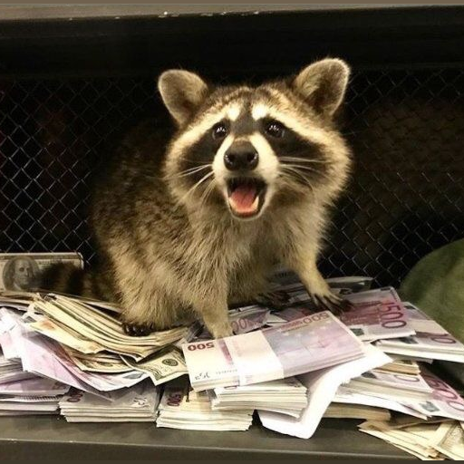

# RAB Slack Bot

  

## Creating Slack App

First, you need to create a Slack App on [api.slack.com](https://api.slack.com).

You can find example of Slack App Manifest to bootstrap your RAB Slack Bot App [here](documentation/slack/app_manifest.yml).
Please note that you'll need to come back later on this app to set up the deployed cloud function url.

Don't forget to install it to your workspace to get the Slack Bot Token.

## Deploying functions

Then, you need to deploy cloud functions, to do that you can use the firebase client. Before launching deployment, you have to define several env vars :
- `SLACK_BOT_TOKEN` Slack App Bot token
- `SLACK_RAB_CHANNEL` Name of Slack channel where daily reporting will be posted
- `SLACK_RAB_MEMBER_HANDLES` JSON array of Slack handles (i.e. users allowed to use Slash Commands)
- `SLACK_SIGNING_SECRET` Slack App secret signing
- `KUCOIN_API_BASE_URL` KuCoin API Base URL (without /api)
- `KUCOIN_API_KEY` KuCoin API Key
- `KUCOIN_API_PASSPHRASE` KuCoin API Passphrase
- `KUCOIN_API_SECRET` KuCoin API Secret
- `FTX_API_BASE_URL` FTX API Base URL (without /api)
- `FTX_API_KEY` FTX API Key
- `FTX_API_SECRET` FTX API Secret
- `FTX_SUBACCOUNT` FTX Subaccount of RAB

## Features

### Slash Commands

These commands are available :
- `/rab-wallet` Show a report of RAB Fund Wallet (only visible by user who typed command)

### Daily reporting

A daily reporting of RAB Fund Wallet will be posted in channel corresponding to `SLACK_RAB_CHANNEL` at 9:55AM everyday.
